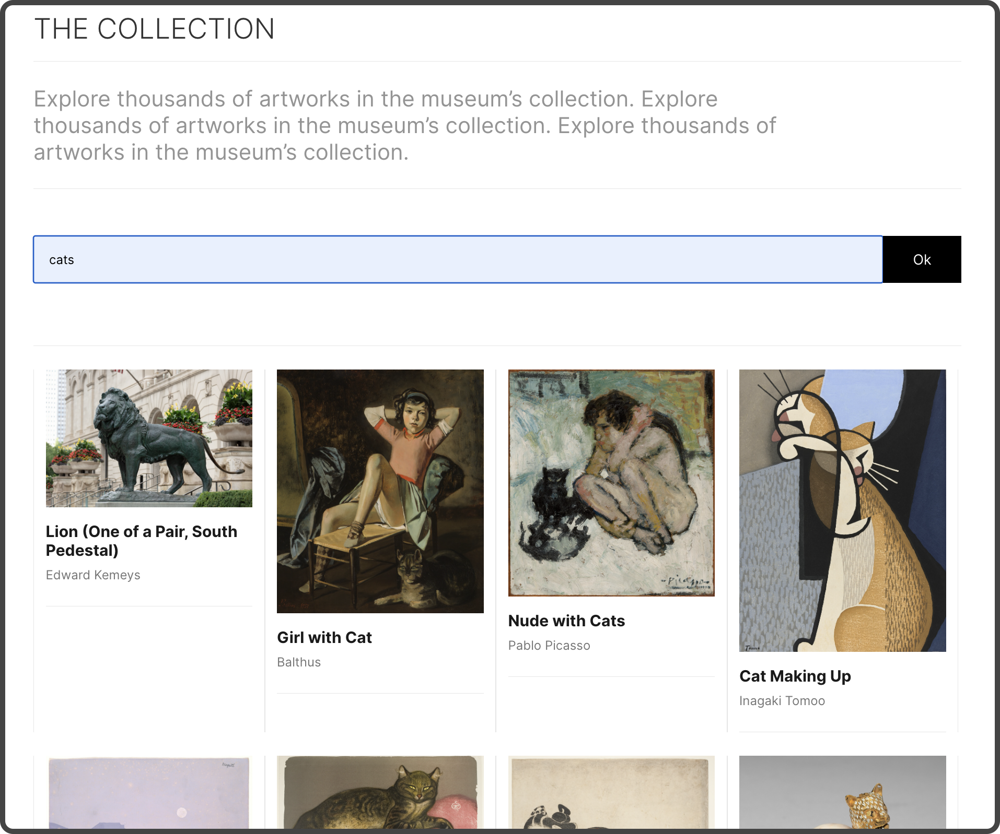
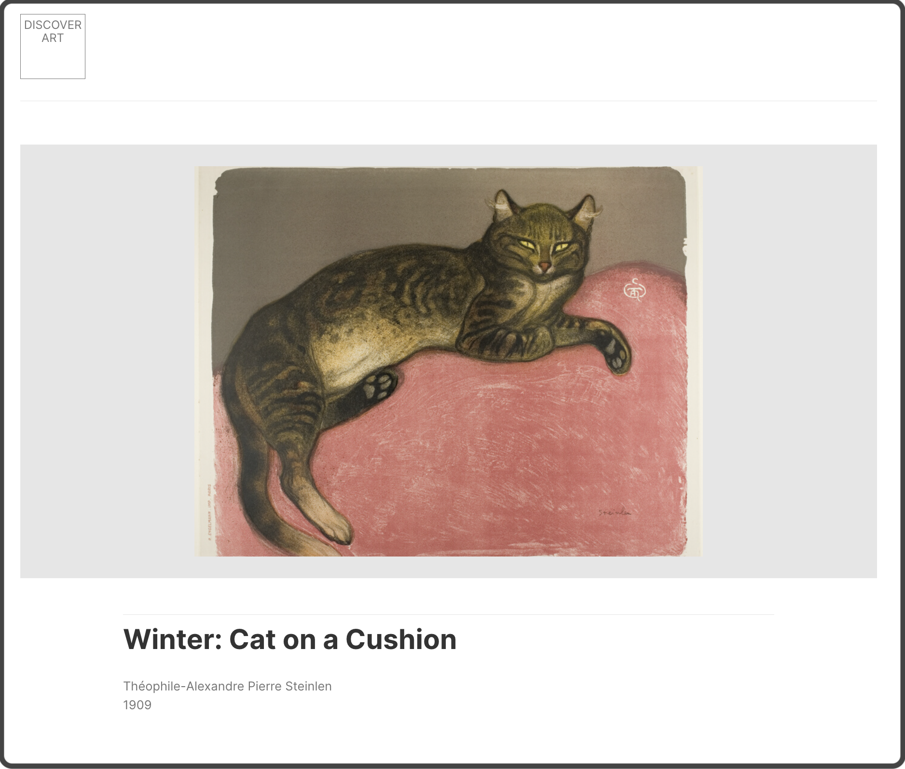

# Project "Art Research"

## Review
* Link to GitHub repository
* Link to published website
* Link to public API
* Description
* Features

---

### Link GitHub Pages:
* https://github.com/TikhonovaKs/art-research.git

### Link to published website:
* 

### Link to public API:
* https://api.artic.edu/docs/#introduction

---

### Description
***Art Research*** is a website that uses information from the "Art Institute of Chicago API".

Capabilities:
* You can search for art objects by entering a keyword in the search form
* When you refresh the page, you will see your last displayed search list
* Clicking on one of the loaded cards will redirect you to the page for that card with a detailed description of the art object

---

### Features:
